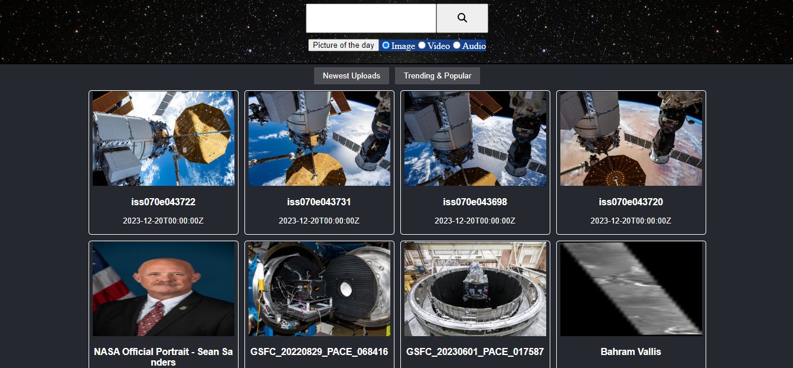
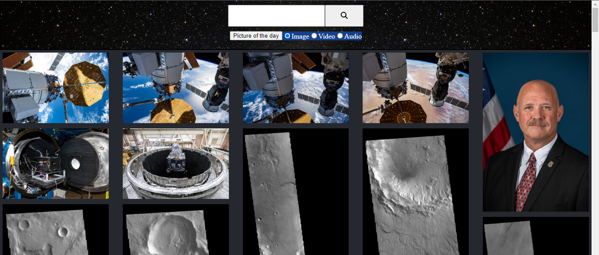

# Version 1

1. Basic view of Trending and latest news, based on Nasa API all the Images are clickable and presented in a card Format
2. Each card is clicable and renders CardModal Component which display the information of respective card clicked using react-modal
3. Header contains input with search button which works and render the searched data on a homepage and APOD (Astronomical Picture of the day) 
4. Very basic styling with no color added except for border 
5. Added logs and Instruction on how one can use the site 
6. Basic project folder structure where component folder represents the files that are used to render the elements of an entire page 
7. Container folder represents reusable components 

# Version 1.1

1. Packages installed react-spring, react-router, react-router-dom, react-use-measure, lodash.shuffle
2. Added Routing currently only 3 pages are added /, test, *
3. Added styling to header by adding background Image
4. Added asset folder to use default images this images are generated using Bing chat
5. Test folder is created to test and implement new ways to render HomePage

# Version 1.2

1. Added Mosaic/ Masonry layout in the home page it resolves stretching or compression of displayed image. Mosaic layout also make webpage visually more appealing. also removed card presentation display 

## Before 

## After

2. Created separate Masonry Layout with url as props or parameters so that it will be easier to display the webpage with mosaic layout

3. Masonry Effect is acheived with the help of react-photo-album

4. Added custom styles in Modal

5. Added video overlay to distinguish between images and video.

6. HeaderModal APOD UI fix.

7. Focus and Active UI fix in the Homepage with respect to Trending and latest button